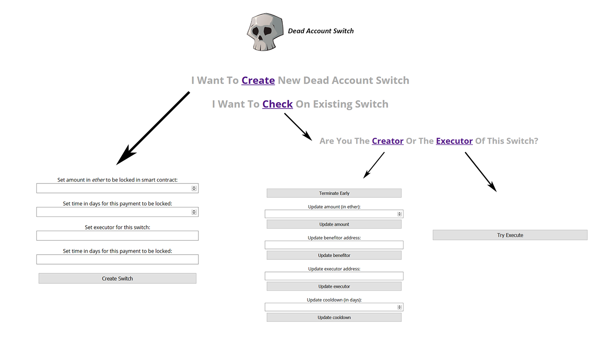
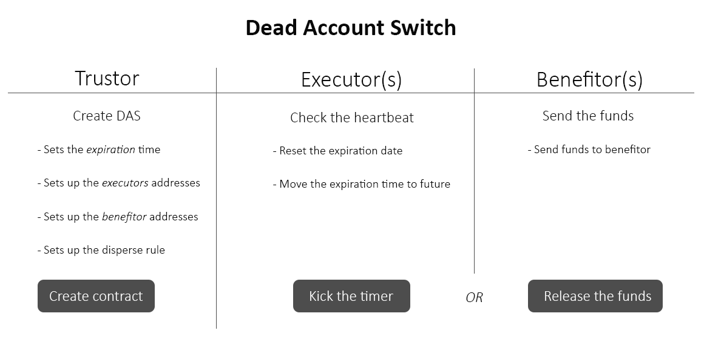

# Dead Man's Switch

This is a simple demo implementing Dead Account Switch on Ethereum Blockchain.
This ```DeadAccountSwitch.sol``` provides standard methods and processes for safe transactions based on `block height`. This enables users to upfront secure their accounts from lockout after account user-predefined time, by predefining fallback addresses to transfer the funds to.

*Google's Inactive Account Manager allows the account holder to nominate someone else to access their services if not used for an extended period.*

Source: https://en.wikipedia.org/wiki/Dead_man%27s_switch

## How it will work here?

### Flowchart



### Entities


## Requirements

Node.js version +5

## Installation

Install ganache and truffle
```
npm install -g truffle
```
## Run it

```
npm run dev
```

## TODO
- Install OpenZeppelin Ownable, Pausable, Destructible, ReentrancyGuard etc.
- Add support for [] of benefitors and executors, max. 5 per each 
- Add update, termination fees
- Hook contract calls to JS
- Add eventListener on front-end
- Add support for % based dispersal of switch funds towards benefitors
- Separate bussines payout logic from main contract in separate contract
- Check long-term gas consumption

## License

This project is licensed under the MIT License

